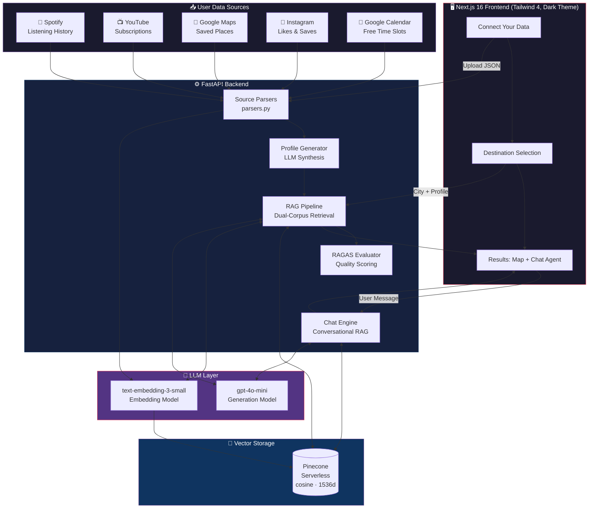
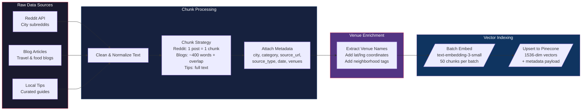
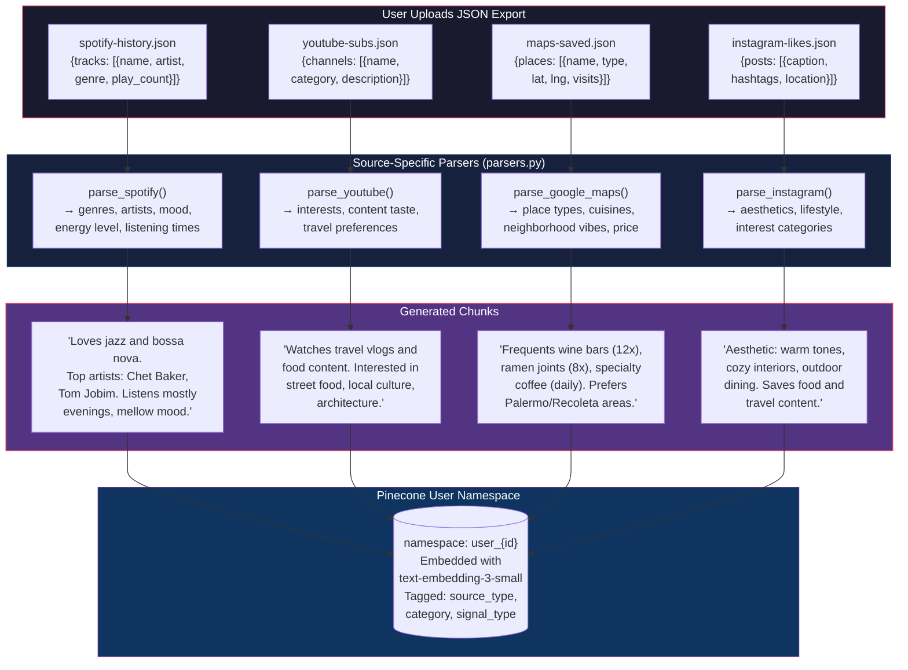
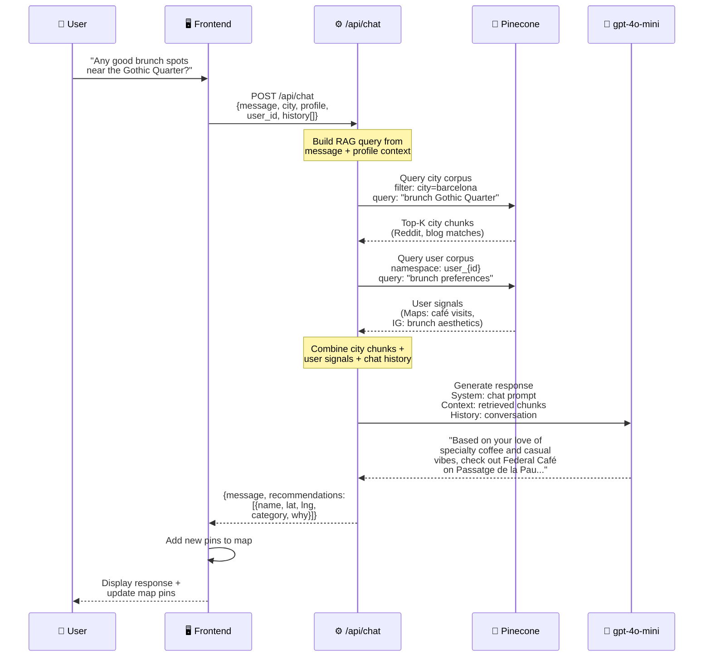
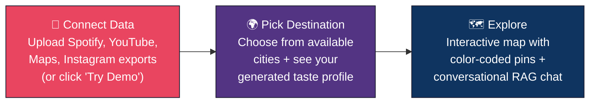

# 🧭 CityScout — Personalized City Guides Powered by Multi-Source RAG

CityScout creates hyper-personalized travel guides by combining your digital footprint (Spotify, YouTube, Google Maps, Instagram) with local city knowledge through a **dual-corpus Retrieval-Augmented Generation (RAG)** pipeline. It synthesizes recommendations from Reddit posts, blogs, and local tips — personalized to YOUR taste — with source citations for every recommendation.

## System Architecture



## RAG Pipeline — Deep Dive

The core of CityScout is a **dual-corpus RAG** system that retrieves from two separate knowledge bases and synthesizes a unified, personalized response.

```mermaid
flowchart TD
    subgraph Input["1️⃣ INPUT"]
        UP[User Profile<br/>Generated from connected data]
        CT[Target City<br/>e.g. Barcelona]
    end

    subgraph QueryGen["2️⃣ QUERY GENERATION"]
        MQ[Main Query<br/>"Recommendations for someone who<br/>loves jazz, specialty coffee,<br/>casual dining in Barcelona"]
        CQ1[Category Query: Coffee<br/>"Best specialty coffee for<br/>third-wave enthusiast"]
        CQ2[Category Query: Food<br/>"Casual restaurants, Japanese,<br/>Mexican cuisine"]
        CQ3[Category Query: Nightlife<br/>"Jazz bars, cocktail bars,<br/>not clubs"]
        CQ4[Category Query: Culture<br/>"Art galleries, indie bookstores,<br/>local markets"]
    end

    subgraph Embedding["3️⃣ EMBEDDING"]
        E1[/"text-embedding-3-small<br/>1536 dimensions<br/>OpenAI API"/]
    end

    subgraph Retrieval["4️⃣ DUAL-CORPUS RETRIEVAL"]
        subgraph CityCorpus["City Knowledge Corpus"]
            CC[(Pinecone<br/>filter: city=barcelona)]
            CC1[Reddit posts from r/Barcelona]
            CC2[Travel blog articles]
            CC3[Local tips & guides]
            CC --> CC1 & CC2 & CC3
        end
        subgraph UserCorpus["User Data Corpus"]
            UC[(Pinecone<br/>namespace: user_{id})]
            UC1[Spotify: jazz, bossa nova,<br/>indie rock patterns]
            UC2[Maps: wine bars, ramen joints,<br/>CrossFit gyms frequented]
            UC3[YouTube: travel vlogs,<br/>food channels watched]
            UC4[Instagram: aesthetic preferences,<br/>lifestyle signals]
            UC --> UC1 & UC2 & UC3 & UC4
        end
    end

    subgraph Rerank["5️⃣ DEDUPLICATION & RANKING"]
        DR[Deduplicate by chunk ID<br/>Sort by cosine similarity score<br/>Ensure category diversity]
    end

    subgraph Synthesis["6️⃣ LLM SYNTHESIS"]
        SY[/"gpt-4o-mini<br/>System: Guide generation prompt<br/>Context: city chunks + user signals<br/>Output: narrative guide with citations"/]
    end

    subgraph Output["7️⃣ OUTPUT"]
        NG[📖 Narrative Guide<br/>"Your first morning in Barcelona:<br/>walk to Satan's Coffee Corner..."]
        MP[🗺️ Map Pins<br/>Lat/lng for each venue<br/>Color-coded by category]
        SC[📎 Source Citations<br/>Reddit post, blog URL,<br/>similarity score]
        RS[📊 RAGAS Scores<br/>Faithfulness, Precision,<br/>Relevancy]
    end

    UP & CT --> MQ
    UP --> CQ1 & CQ2 & CQ3 & CQ4
    MQ & CQ1 & CQ2 & CQ3 & CQ4 --> E1
    E1 -->|"5 query vectors"| CC
    E1 -->|"main query vector"| UC
    CC1 & CC2 & CC3 --> DR
    UC1 & UC2 & UC3 & UC4 --> DR
    DR -->|"top-K city chunks<br/>+ top-10 user signals"| SY
    SY --> NG & MP & SC & RS

    style Input fill:#1a1a2e,stroke:#e94560,color:#fff
    style QueryGen fill:#16213e,stroke:#0f3460,color:#fff
    style Embedding fill:#533483,stroke:#e94560,color:#fff
    style CityCorpus fill:#0f3460,stroke:#533483,color:#fff
    style UserCorpus fill:#0f3460,stroke:#e94560,color:#fff
    style Rerank fill:#16213e,stroke:#0f3460,color:#fff
    style Synthesis fill:#533483,stroke:#e94560,color:#fff
    style Output fill:#1a1a2e,stroke:#e94560,color:#fff
```

## Data Ingestion Pipeline



## User Data Processing



## Chat Agent Flow



## Product Flow



## Tech Stack

| Component | Technology | Purpose |
|-----------|-----------|---------|
| Frontend | Next.js 16, React 19, Tailwind CSS 4 | App shell, routing, dark theme |
| Map | Leaflet.js + react-leaflet | Interactive venue map with category pins |
| Backend | FastAPI (Python) | REST API, RAG orchestration |
| Vector DB | Pinecone (Serverless, cosine, 1536d) | Dual-corpus storage (city + user namespaces) |
| Embeddings | OpenAI `text-embedding-3-small` | 1536-dim vectors for semantic search |
| Generation | OpenAI `gpt-4o-mini` | Profile synthesis, guide narrative, chat |
| Evaluation | RAGAS | Faithfulness, Context Precision, Relevancy |
| Data | Curated JSON (Reddit, blogs, local tips) | City knowledge corpus |

## Why RAG?

CityScout demonstrates why RAG is essential for this use case:

1. **Corpus exceeds context window** — Hundreds of Reddit posts, blog articles, and local tips per city can't fit in a single LLM prompt. RAG retrieves only the most relevant chunks.

2. **Replaces hours of human research** — Users typically spend 2-5 hours reading Reddit threads, blogs, and review sites to plan a trip. RAG synthesizes this in seconds.

3. **Citations build trust** — Every recommendation links back to its source (Reddit post, blog article). Users can verify recommendations, unlike hallucination-prone direct LLM responses.

4. **Personalization through dual-corpus** — By maintaining separate corpora (city knowledge + user data), the retrieval step naturally surfaces the intersection of "what exists in this city" and "what this specific user would love."

5. **The retrieval layer IS the moat** — The quality of indexed city knowledge (curated, verified, fresh) is what differentiates CityScout from asking ChatGPT. The corpus is the product.

## Setup

### Prerequisites

- Python 3.11+
- Node.js 20+
- OpenAI API key (or OpenRouter for proxy)
- Pinecone API key

### Backend

```bash
# Create virtual environment
python -m venv .venv && source .venv/bin/activate

# Install dependencies
pip install -r requirements.txt

# Configure environment
cp .env.example .env
# Edit .env with your API keys

# Run tests
cd api && python -m pytest tests/ -v

# Start API server
python api/server.py
```

### Frontend

```bash
cd web
npm install
npm run dev
```

### Data Ingestion

1. Start the API server
2. Click "Index Data" on the landing page, or:
```bash
curl -X POST http://localhost:3001/api/ingest
```

## API Endpoints

| Method | Path | Description |
|--------|------|-------------|
| GET | `/api/health` | Health check |
| GET | `/api/cities` | List available cities with metadata |
| POST | `/api/ingest` | Start city data ingestion to Pinecone |
| GET | `/api/ingest/status` | Ingestion progress |
| POST | `/api/profile` | Generate taste profile from quiz |
| POST | `/api/profile/upload` | Upload user data (Spotify/YouTube/Maps/IG) |
| GET | `/api/profile/user/{id}` | Check uploaded data status |
| POST | `/api/guide` | Generate personalized guide (dual-corpus RAG) |
| POST | `/api/chat` | Conversational RAG agent |

## Data Format

### City Knowledge (`data/cities/*.json`)

```json
{
  "id": "ba-coffee-01",
  "city": "buenos-aires",
  "category": "coffee",
  "source_type": "reddit",
  "source_url": "https://reddit.com/r/BuenosAires/comments/...",
  "date": "2024-11-15",
  "text": "Best specialty coffee in Buenos Aires — LAB Tostadores in Palermo...",
  "venues": [
    {
      "name": "LAB Tostadores",
      "lat": -34.5875,
      "lng": -58.4324,
      "neighborhood": "Palermo Hollywood"
    }
  ]
}
```

### User Data (`data/sample-user/`)

Sample exports for demo mode: `spotify-history.json`, `youtube-subscriptions.json`, `maps-saved-places.json`

## Testing

```bash
cd api
python -m pytest tests/test_rag.py -v
```

**39 tests** covering:
- Text chunking strategy (overlap, edge cases)
- City data loading and validation
- Source-specific parsers (Spotify, YouTube, Maps, Instagram)
- User data upload endpoint
- Dual-corpus RAG retrieval
- Profile generation (mocked)
- Guide generation with citations (mocked)
- RAGAS evaluation structure
- API endpoint availability
- Data quality validation (minimum chunks, realistic text, category diversity)

## License

MIT
